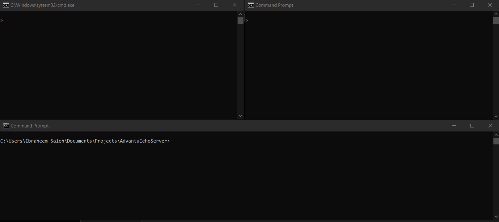
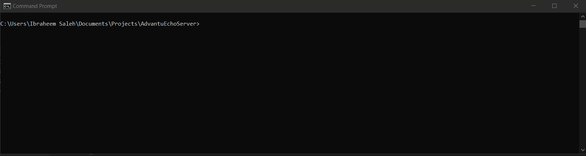

# Advantu Echo Server

This source repository provides a simple Python-based implementation for an Echo Server, an Echo Client, a log archival script, and a pytest based test suite to test these components.

The purpose of this repository is to demonstrate the ability to code in Python to assist Advantu in their hiring decision. All code in this repository is covered under the [MIT-License](License.md)


## Software Requirements
The list of requirements & concepts discussed with Advantu are as follows (with code references):

* Create an [Echo Server](EchoServer.py)
    * A [Client App](EchoClient.py) should be able to say "Hi There" and it should echo it
* Exercise Socket Communication -- Threads or processes talking to each other over a socket [1](EchoServerTest.py?plain=1#L99) [2](EchoServer.py?plain=1#L67) [3](EchoClient.py?plain=1#L27)
* Demonstrate ability to use [PyTest](EchoServerTest.py) [1](EchoServerTest.py?plain=1#L91) [2](EchoServerTest.py?plain=1#L140) [3](EchoServerTest.py?plain=1#L153) 
* Demonstrate use of Enums [1](EchoServer.py?plain=1#L16) [2](EchoServer.py?plain=1#L100) [3](EchoServer.py?plain=1#L114) [4](EchoServer.py?plain=1#L122)
* Demonstrate use of Logging [1](EchoServer.py?plain=1#56) [2](EchoServer.py?plain=1#79) [3](EchoServer.py?plain=1#99)
* Use Python dictionaries & understand how they're laid out [1](EchoServer.py?plain=1#L122) [2](EchoServer.py?plain=1#L114) [3](EchoClient.py?plain=1#L)
* Demonstrate ability to use JSON [1](LogArchive.py?plain=1#L41) [2](LogArchive.py?plain=1#L34)
* Demonstrate the translation of text into spreadsheets using Pandas CSV library [1](LogArchive.py?plain=1#L26)

## Usage Examples
*Start the Echo Server*
```
python EchoServer.py --host localhost --port 7777
```
*Start the Echo Client*
```
python EchoClient.py --host localhost --port 7777
```
*Input messages from the client, see them echoed back from the server*
```
Input: Hello world!
Echo:  Hello world!
```
## Demo
The following section demos how to use the various components of this project.

### Using the EchoServer and EchoClient Demo


### Using the LogArchive Script Demo


### Executing the Tests Demo


## Documentation
### API Documentation
The API documentation is autogenerated with Sphinx.

[Documentation is available here](doc/_build/html/index.html)
### CLI Arguments Documentation
Each of the Applications supports --help to display the supported command line arguments.

*EchoServer*
```
EchoServer --help
usage: EchoServer.py [-h] [-s HOST] [-p PORT] [-m {LOG_CONSOLE,LOG_FILE,LOG_BOTH}] [-f LOG_FILE] [-l {CRITICAL,FATAL,ERROR,WARN,WARNING,INFO,DEBUG,NOTSET}]

Socket Server

options:
  -h, --help            show this help message and exit
  -s HOST, --host HOST
  -p PORT, --port PORT
  -m {LOG_CONSOLE,LOG_FILE,LOG_BOTH}, --log_mode {LOG_CONSOLE,LOG_FILE,LOG_BOTH}
  -f LOG_FILE, --log_file LOG_FILE
  -l {CRITICAL,FATAL,ERROR,WARN,WARNING,INFO,DEBUG,NOTSET}, --log_level {CRITICAL,FATAL,ERROR,WARN,WARNING,INFO,DEBUG,NOTSET}
```
*EchoClient*
```
EchoClient --help
usage: EchoClient.py [-h] [-s HOST] [-p PORT]

options:
  -h, --help            show this help message and exit
  -s HOST, --host HOST  Host
  -p PORT, --port PORT  Port
```
*LogArchive*
```
LogArchive --help
usage: LogArchive.py [-h] [-i INPUT_FILE] [-o OUTPUT_FILE] [-a {True,False}] [-j {True,False}] [-p {True,False}]

Log Archive Script

options:
  -h, --help            show this help message and exit
  -i INPUT_FILE, --input_file INPUT_FILE
                        Input EchoServer Logfile
  -o OUTPUT_FILE, --output_file OUTPUT_FILE
                        Output Archival File
  -a {True,False}, --add_timestamp {True,False}
                        Automatically add timestamp to output archive filename before extension
  -j {True,False}, --json {True,False}
                        Output as JSON
  -p {True,False}, --print_messages_json {True,False}
                        Print all messages in JSON, don't save anything
```